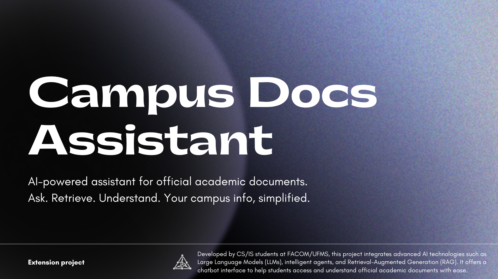
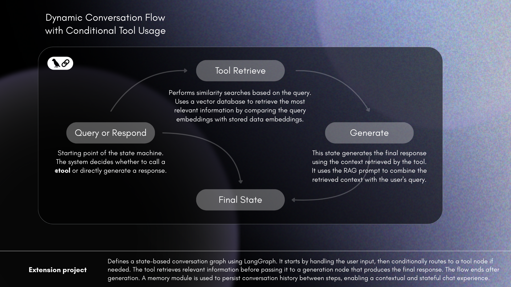
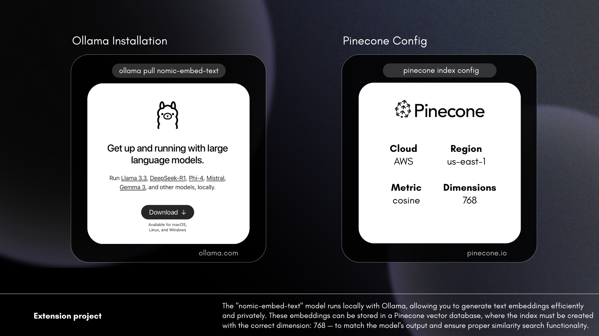

### **INTRODUCTION**

The **Campus Docs Assistant** is a powerful AI-driven application designed to assist students and faculty members of the Federal University of Mato Grosso do Sul (UFMS) in accessing legal, academic, and administrative documents. This tool simplifies the process of retrieving information about university policies, mandatory internships, enrollment procedures, faculty contacts, and more. By leveraging state-of-the-art AI technologies, the assistant provides accurate, concise, and context-aware responses to user queries.

The project integrates cutting-edge tools such as **LangChain**, **Pinecone**, **Ollama**, and **Streamlit** to deliver a seamless and interactive user experience. It is built with modularity, scalability, and maintainability in mind, making it a robust solution for academic and administrative needs.

---

### **FEATURES**

### **1. AI-Powered Query Handling**
- **Maritalk Integration**: The assistant uses the Maritalk LLM (Large Language Model) to process user queries and generate intelligent responses. Maritalk is optimized for conversational AI and supports advanced natural language understanding.
- **Tool Decision System**: The assistant evaluates user queries to decide whether to call external tools (e.g., document retrieval) or respond directly based on the conversation context.

### **2. Document Retrieval with Pinecone**
- **Vector Search**: The assistant uses Pinecone, a high-performance vector database, to perform similarity searches. This allows it to retrieve the most relevant documents based on the user's query.
- **Ollama Embeddings**: The assistant leverages Ollama's embedding models to convert text into vector representations, enabling efficient and accurate similarity searches.

### **3. Context-Aware Responses**
- **RAG (Retrieve and Generate)**: The assistant combines retrieved document content with user queries to generate precise and context-aware responses. This is achieved using LangChain's RAG capabilities.
- **Dynamic Context Management**: The assistant maintains a clean and concise conversation history, ensuring that responses are relevant and free from unnecessary information.

### **4. Web Scraping and Indexing**
- **Playwright Integration**: The assistant uses Playwright to scrape and render web pages, enabling it to index external content into Pinecone for future queries.
- **Chunking with LangChain**: The assistant splits large documents into manageable chunks using LangChain's text splitters, ensuring efficient indexing and retrieval.

### **5. Interactive User Interface**
- **Streamlit Framework**: The assistant features an intuitive and interactive UI built with Streamlit. Users can input queries, view responses, and configure settings directly from the web interface.
- **Real-Time Feedback**: The assistant provides real-time feedback through toasts, spinners, and dynamic updates, enhancing the user experience.

### **6. Modular and Scalable Architecture**
- **LangChain State Machine**: The assistant uses LangChain's state machine and ToolNode to manage the flow of interactions, ensuring modularity and scalability.
- **Error Handling**: Comprehensive error handling mechanisms are in place to manage runtime errors, API issues, and unexpected failures gracefully.

---

### **TECHNOLOGIES**

### **1. LangChain**
LangChain is the backbone of the assistant's architecture, providing tools for:
- **Prompt Engineering**: Custom prompts for tool decision-making and RAG.
- **State Management**: Managing conversation history and tool calls.
- **Text Processing**: Splitting and formatting text for efficient retrieval and response generation.

### **2. Pinecone**
Pinecone is a vector database used for:
- **Similarity Search**: Retrieving the most relevant documents based on user queries.
- **Scalability**: Handling large datasets with low latency and high throughput.

### **3. Ollama**
Ollama provides embedding models for:
- **Text Vectorization**: Converting text into vector representations for similarity search.
- **Custom Embeddings**: Supporting domain-specific embeddings for academic and administrative content.

### **4. Maritalk**
Maritalk is the LLM used for:
- **Natural Language Understanding**: Processing user queries and generating intelligent responses.
- **Conversational AI**: Supporting dynamic and context-aware interactions.

### **5. Streamlit**
Streamlit is the framework used for:
- **Web Interface**: Building an interactive and user-friendly UI.
- **Real-Time Updates**: Providing dynamic feedback and updates to users.

### **6. Playwright**
Playwright is used for:
- **Web Scraping**: Rendering and extracting content from web pages.
- **Automation**: Automating the process of indexing external content.

---

### **INSTALLATION GUIDE**

### **Steps**

1. **Clone the Repository**
   ```bash
   git clone https://github.com/GiovaneIwamoto/campus-docs-assistant.git
   cd campus-docs-assistant
   ```

2. **Install Dependencies**
   ```bash
   pip install -r requirements.txt
   ```

3. **Install Playwright**
   ```bash
   pip install playwright
   playwright install
   ```

5. **Run the Application**
   ```bash
   cd app
   streamlit run app.py
   ```

---

### **USAGE**

### **1. Query Handling**
- Enter your query in the chat input box.
- The assistant will decide whether to call a tool or respond directly.

### **2. Document Retrieval**
- Queries related to university documents will trigger the retrieve tool.
- The assistant will fetch the most relevant documents from Pinecone and generate a response.

### **3. Web Scraping and Indexing**
- Use the sidebar to enable indexing mode.
- Enter a URL to scrape and index its content into Pinecone.

### **4. Configuration**
- Use the sidebar to configure API keys, Pinecone index name, and embedding model.

